# 🔥 AI AGENT INTEGRATION AUDIT REPORT
## SpedireSicuro.it - MAX MODE Analysis

**Data:** 1 Gennaio 2026  
**Repository:** gdsgroupsas-jpg/spediresicuro (master)  
**Auditor:** AI Agent Integration Auditor MAX MODE

---

## 1. SUMMARY VERDICT

### **INTEGRATION VERDICT: ✅ YES (with P1 prerequisites)**

The SpedireSicuro codebase is **architecturally ready** for an Internal AI Agent integration. The existing LangGraph Supervisor pattern, clean adapter abstractions, explicit Acting Context, and well-defined invariants provide a solid foundation.

| Dimension | Status | Risk Level |
|-----------|--------|------------|
| Architecture Consistency | ✅ Excellent | Low |
| LangGraph Compatibility | ✅ Ready | Low |
| Security Boundaries | ✅ Strong | Low |
| Wallet Invariants | ✅ Atomic | Low |
| Frontend UX Readiness | ⚠️ Partial | Medium |
| Documentation Alignment | ⚠️ Minor Gaps | Medium |
| Conversation Persistence | ❌ Missing | P1 Blocker |

**Critical P1 Prerequisite:** Before exposing a conversational AI Agent to users, a `conversation_history` or `agent_sessions` table is required for multi-turn context persistence. Currently, conversations are stateless (session storage only).

---

## 2. BACKEND AUDIT (Deep)

### 2.1 Architecture Consistency ✅

**Strengths:**
- **Clean separation of concerns:** `lib/agent/` (orchestrator), `lib/adapters/` (couriers), `lib/wallet/` (financial), `actions/` (server actions)
- **Strangler Fig Pattern:** Legacy Claude handler coexists with LangGraph workers - safe incremental migration
- **Courier Adapter Pattern:** Provider-agnostic design via `CourierAdapter` abstract class (`lib/adapters/couriers/base.ts`)
- **Factory Pattern:** Database-backed courier instantiation (`getCourierConfigForUser`)
- **Centralized Config:** `lib/config.ts` holds all magic constants for easy tuning

**Architecture Violations Found:** None

**Risks for Agent Integration:**

| Risk | Severity | Mitigation |
|------|----------|------------|
| Agent might call deprecated `auth()` instead of `getSafeAuth()` | Medium | ESLint rule already enforces this |
| Agent could attempt direct wallet_balance UPDATE | Critical | SQL CHECK constraints + no RLS bypass |

### 2.2 Missing Abstractions

| Missing | Impact | Recommendation |
|---------|--------|----------------|
| `AgentSession` service | Agent cannot persist multi-turn context | Create `lib/services/agent-session.ts` |
| `AgentTool` registry | Tools scattered in `lib/ai/tools.ts` and `lib/agent/tools.ts` | Unify into single registry |
| `AgentAuditLogger` | No dedicated audit trail for agent actions | Extend `writeAuditLog` with `AUDIT_RESOURCE_TYPES.AGENT_ACTION` |

### 2.3 Gap Analysis

**Orchestrator Gaps:**
- ❌ No `mentor_worker` for debugging assistance
- ❌ No `explain_worker` for architecture Q&A
- ❌ Supervisor currently routes only: `pricing_worker`, `address_worker`, `ocr_worker`, `booking_worker`, `legacy`

**API Route Gaps:**
- ⚠️ `/api/ai/agent-chat` exists but uses Claude for legacy path, not unified agent
- ⚠️ `/api/anne/chat` exists but separate from LangGraph supervisor

---

## 3. FRONTEND / UX / UI AUDIT (Deep)

### 3.1 UX Patterns Compatibility ✅

**Existing AI UI Components:**

| Component | Location | Pattern |
|-----------|----------|---------|
| `AnneAssistant` | `components/anne/AnneAssistant.tsx` | Floating ghost bubble (bottom-right) |
| `AnneContext` | `components/anne/AnneContext.tsx` | React Context for proactive suggestions |
| `AIAssistantModal` | `components/ai/ai-assistant-modal.tsx` | Modal-based chat |
| `VoiceControlPanel` | `components/ai/voice-control-panel.tsx` | Voice input panel |

**Compatibility:** ✅ Excellent - patterns already exist

### 3.2 Missing Components

| Missing | Priority | Description |
|---------|----------|-------------|
| `AgentDebugPanel` | P2 | Show supervisor routing decisions, worker traces |
| `AgentConversationHistory` | P1 | List past sessions (requires DB table) |
| `AgentContextViewer` | P2 | Display current `ShipmentDraft`, `AgentState` |

### 3.3 UI Inconsistencies

- ⚠️ `AnneAssistant` uses Anthropic Claude directly, bypassing LangGraph supervisor
- ⚠️ Duplicate API endpoints: `/api/ai/agent-chat` vs `/api/anne/chat`
- ⚠️ Mobile nav does not show Anne assistant (desktop only)

### 3.4 Where AI Agent Could Live

**Recommended:** Extend existing `AnneAssistant` component:
1. Replace direct Claude calls with `supervisorRouter()` invocation
2. Add `mentor_worker` option to supervisor routing
3. Keep floating ghost UX pattern (already tested, user-friendly)

---

## 4. AI ORCHESTRATOR ALIGNMENT

### 4.1 Fit with LangGraph Supervisor ✅

**Current Architecture (`lib/agent/orchestrator/supervisor-router.ts`):**

```
supervisorRouter()
    ├── detectPricingIntent()
    ├── containsOcrPatterns()
    └── decideNextStep()
        ├── pricing_worker → pricingGraph.invoke()
        ├── address_worker → (via graph)
        ├── ocr_worker → (via graph)
        ├── booking_worker → (via graph)
        └── legacy → Claude handler (fallback)
```

**Fit Assessment:** ✅ Perfect fit - The AI Agent can be added as a new worker type.

### 4.2 Required New Nodes/Workers

| Worker | Purpose | Priority |
|--------|---------|----------|
| `mentor_worker` | Answer technical questions, explain architecture | P1 |
| `debug_worker` | Analyze logs, suggest fixes, trace errors | P2 |
| `query_worker` | Execute read-only DB queries for analysis | P2 |
| `explain_worker` | Explain business flows, wallet rules, RLS | P2 |

### 4.3 Required State Fields

Add to `AgentState` (`lib/agent/orchestrator/state.ts`):

```typescript
// New fields for AI Agent
agent_context?: {
  session_id: string;
  conversation_history: Message[];
  user_role: UserRole;
  current_page?: string;
  is_impersonating: boolean;
};

// Mentor-specific
mentor_response?: {
  answer: string;
  sources: string[]; // file paths referenced
  confidence: number;
};
```

### 4.4 Potential Conflicts

| Conflict | Resolution |
|----------|------------|
| Agent tries to book shipment without wallet check | `booking_worker` already has `preflightCheck()` - reuse |
| Agent impersonates without `getSafeAuth()` | Supervisor must inject `ActingContext` into state |
| Agent loops infinitely | `MAX_ITERATIONS: 2` guard already exists in config |

---

## 5. SECURITY & INVARIANTS CHECK

### 5.1 Wallet Atomicity ✅

**Enforcement:**
- ✅ `decrement_wallet_balance()` - PostgreSQL function with `FOR UPDATE NOWAIT`
- ✅ `increment_wallet_balance()` - Same atomic pattern
- ✅ `add_wallet_credit()` - Wrapper with transaction insert
- ✅ `withConcurrencyRetry()` - Retry wrapper for lock contention (`lib/wallet/retry.ts`)

**Agent Risk:** ❌ None - Agent cannot call RPC directly; must go through booking_worker which validates

### 5.2 RLS ✅

**Enforcement:**
- ✅ All tenant tables have RLS enabled
- ✅ `wallet_transactions` has NO INSERT policy (only SECURITY DEFINER functions)
- ✅ `idempotency_locks` has RLS with service_role bypass only

**Agent Risk:** Low - Agent queries go through `supabaseAdmin` (server-side) with explicit userId filter

### 5.3 Acting Context ✅

**Enforcement:**
- ✅ `getSafeAuth()` / `requireSafeAuth()` enforced via ESLint rule
- ✅ Header `x-sec-impersonate-target` injected by middleware only
- ✅ `ActingContext` distinguishes `actor` (who clicks) vs `target` (who pays)

**Agent Risk:** Medium - Agent must pass `ActingContext` to all workers. **Recommendation:** Inject `ActingContext` into `AgentState` at `supervisorRouter` entry point.

### 5.4 Audit Trail ✅

**Enforcement:**
- ✅ `writeAuditLog()` with `AUDIT_ACTIONS` constants
- ✅ Wallet operations always call `writeWalletAuditLog()`
- ✅ `audit_logs` table with RLS

**Agent Risk:** Low - Add `AUDIT_ACTIONS.AGENT_QUERY`, `AUDIT_ACTIONS.AGENT_MENTOR_RESPONSE` for agent-specific actions

### 5.5 Courier Adapter Isolation ✅

**Enforcement:**
- ✅ `CourierAdapter` abstract class
- ✅ Factory pattern with database-backed credentials
- ✅ No env var fallback (database only)

**Agent Risk:** None - Agent cannot access courier credentials directly

### 5.6 Idempotency ✅

**Enforcement:**
- ✅ `idempotency_locks` table with TTL
- ✅ `acquire_idempotency_lock()` RPC function
- ✅ Status: `in_progress` → `completed` | `failed`

**Agent Risk:** Low - `booking_worker` already requires `idempotency_key`

### 5.7 Compensation Queue ⚠️

**Finding:** The `compensation_queue` table is referenced in documentation (`docs/DB_SCHEMA.md`) and code (`app/api/shipments/create/route.ts`), but:
- ⚠️ No dedicated migration file found
- ⚠️ No dedicated service/worker for processing

**Agent Risk:** Medium - If agent triggers a failed booking, orphan records may not be cleaned up

### 5.8 Soft Delete ✅

**Enforcement:**
- ✅ `deleted_at` column on `shipments`, `users`
- ✅ RLS policy `prevent_orphan_shipments` checks `deleted_at IS NULL`
- ✅ Dedicated page at `/dashboard/spedizioni/cancellate`

**Agent Risk:** None

---

## 6. DOCUMENTATION CONSISTENCY CHECK

### 6.1 Alignments ✅

| Doc | Code | Status |
|-----|------|--------|
| README.md (3 business models) | Implemented in courier factory | ✅ Aligned |
| MONEY_FLOWS.md (atomic wallet) | `040_wallet_atomic_operations.sql` | ✅ Aligned |
| ARCHITECTURE.md (Acting Context) | `lib/safe-auth.ts` | ✅ Aligned |
| DB_SCHEMA.md (RLS policies) | Migrations 033-044 | ✅ Aligned |

### 6.2 Misalignments ⚠️

| Doc | Issue | Severity |
|-----|-------|----------|
| ROADMAP.md claims "AI Anne Chat UI - Backend Ready" | Backend is split between Claude and LangGraph (not unified) | P2 |
| OCR_SYSTEM_MAP.md mentions "Tesseract fallback" | Code shows Gemini Vision as primary, Tesseract is 3rd fallback | P3 |
| DB_SCHEMA.md shows `compensation_queue` | No migration file found with that exact name | P2 |
| MIGRATION_MEMORY.md claims 264 unit tests | Actual count in `tests/unit/`: 12 files | P3 (docs outdated) |

### 6.3 Missing Documentation

| Missing | Priority |
|---------|----------|
| `docs/AGENT_ARCHITECTURE.md` | P1 - Document agent workers, state, tools |
| `docs/BYOC_IMPLEMENTATION.md` | P2 - Document BYOC-specific flows |
| `docs/CONVERSATION_PERSISTENCE.md` | P1 - Document how to store agent sessions |

---

## 7. AUTOMATIC TEST SPECIFICATIONS

### 7.1 Wallet Atomicity Tests

#### TEST-WALLET-001: Concurrent Debit Race Condition
- **Purpose:** Verify no double-debit under concurrent requests
- **Preconditions:** User has €100 balance; two simultaneous requests for €60 each
- **Assertions:**
  - Only ONE request succeeds
  - Final balance is €40 (not €-20)
  - Second request returns `55P03` lock error
- **Failure modes:** Negative balance, both succeed
- **Severity:** P0

#### TEST-WALLET-002: Insufficient Balance Rejection
- **Purpose:** Verify debit fails cleanly when balance < amount
- **Preconditions:** User has €10 balance; request for €50
- **Assertions:**
  - Error: "Insufficient balance"
  - Balance unchanged (€10)
  - No `wallet_transactions` record created
- **Failure modes:** Partial debit, corrupted state
- **Severity:** P0

#### TEST-WALLET-003: Idempotency Lock Prevents Duplicate Shipment
- **Purpose:** Verify same idempotency_key doesn't create two shipments
- **Preconditions:** Valid shipment data, same idempotency_key sent twice
- **Assertions:**
  - Second request returns existing `shipment_id`
  - Wallet debited only once
  - `idempotency_locks.status = 'completed'`
- **Failure modes:** Double debit, duplicate shipment
- **Severity:** P0

---

### 7.2 RLS Enforcement Tests

#### TEST-RLS-001: User Cannot See Other Users' Shipments
- **Purpose:** Verify RLS isolates shipment data
- **Preconditions:** User A with 5 shipments, User B with 3 shipments
- **Assertions:**
  - User A query returns exactly 5 shipments
  - All returned `user_id` match User A's ID
- **Failure modes:** Cross-tenant data leak
- **Severity:** P0

#### TEST-RLS-002: Reseller Sees Own + Sub-User Shipments
- **Purpose:** Verify reseller hierarchy visibility
- **Preconditions:** Reseller R with 2 sub-users (S1, S2), each with shipments
- **Assertions:**
  - Reseller R sees: own shipments + S1 shipments + S2 shipments
  - S1 sees only own shipments
  - S2 sees only own shipments
- **Failure modes:** Sub-user sees parent, cross-reseller leak
- **Severity:** P0

#### TEST-RLS-003: wallet_transactions INSERT Blocked for Auth Users
- **Purpose:** Verify no client-side wallet manipulation
- **Preconditions:** Authenticated user with anon key
- **Assertions:**
  - Direct INSERT to `wallet_transactions` returns RLS error
  - Only `add_wallet_credit()` RPC succeeds (via service_role)
- **Failure modes:** Client can fake transactions
- **Severity:** P0

---

### 7.3 Acting Context Tests

#### TEST-IMPERSONATE-001: SuperAdmin Impersonation Creates Correct Audit Trail
- **Purpose:** Verify impersonation records both actor and target
- **Preconditions:** SuperAdmin A impersonates User U, creates shipment
- **Assertions:**
  - `shipments.user_id = U` (target owns shipment)
  - `audit_logs.actor_id = A` (admin created it)
  - `audit_logs.target_id = U`
  - `audit_logs.impersonation_active = true`
- **Failure modes:** Missing actor, wrong owner
- **Severity:** P0

#### TEST-IMPERSONATE-002: Non-SuperAdmin Cannot Impersonate
- **Purpose:** Verify role check
- **Preconditions:** Regular user or reseller attempts to set impersonation cookie
- **Assertions:**
  - Middleware rejects, returns 403
  - `getSafeAuth().isImpersonating = false`
- **Failure modes:** Privilege escalation
- **Severity:** P0

---

### 7.4 Courier Adapter Isolation Tests

#### TEST-COURIER-001: Factory Returns Null Without DB Config
- **Purpose:** Verify no env fallback
- **Preconditions:** User has no `courier_configs` entry
- **Assertions:**
  - `getShippingProvider()` returns `null`
  - No hardcoded API keys used
- **Failure modes:** Env var fallback exposes shared credentials
- **Severity:** P1

#### TEST-COURIER-002: BYOC Adapter Uses User's Credentials
- **Purpose:** Verify per-user credential isolation
- **Preconditions:** User U has custom SpedisciOnline config in `courier_configs`
- **Assertions:**
  - Factory returns adapter with U's API key
  - Requests go to U's base_url
- **Failure modes:** Credential mixing
- **Severity:** P1

---

### 7.5 Supervisor Routing Tests

#### TEST-SUPERVISOR-001: Pricing Intent Routes to pricing_worker
- **Purpose:** Verify intent detection → routing
- **Preconditions:** Message: "Quanto costa spedire 5kg a 00100?"
- **Assertions:**
  - `intentDetected = 'pricing'`
  - `supervisorDecision = 'pricing_worker'`
  - `backendUsed = 'pricing_graph'`
- **Failure modes:** Falls back to legacy unnecessarily
- **Severity:** P1

#### TEST-SUPERVISOR-002: OCR Pattern Routes to Graph (Supervisor Decides)
- **Purpose:** Verify OCR detection triggers graph
- **Preconditions:** Message contains base64 image pattern
- **Assertions:**
  - `hasOcrPatterns = true`
  - Graph invoked (not legacy)
  - `workerRun = 'ocr'` in telemetry
- **Failure modes:** OCR fallback to legacy
- **Severity:** P1

#### TEST-SUPERVISOR-003: MAX_ITERATIONS Prevents Infinite Loop
- **Purpose:** Verify loop guard
- **Preconditions:** Graph keeps returning `next_step = 'address_worker'`
- **Assertions:**
  - After 2 iterations, terminates with clarification
  - No stack overflow
- **Failure modes:** Infinite loop, OOM
- **Severity:** P0

---

### 7.6 Soft Delete Tests

#### TEST-SOFTDELETE-001: Deleted Shipment Not Visible in List
- **Purpose:** Verify soft delete hides from normal queries
- **Preconditions:** User has 5 shipments, deletes 1
- **Assertions:**
  - GET `/api/spedizioni` returns 4 shipments
  - Deleted shipment has `deleted_at` set
  - `deleted_by_user_email` populated
- **Failure modes:** Deleted visible, hard delete
- **Severity:** P1

#### TEST-SOFTDELETE-002: Deleted Shipment Visible in Cancellate Page
- **Purpose:** Verify admin/reseller can see deleted
- **Preconditions:** Reseller R deleted a shipment
- **Assertions:**
  - GET `/api/spedizioni/cancellate` returns deleted shipments
  - Includes deletion metadata
- **Failure modes:** Cannot recover/audit
- **Severity:** P2

---

### 7.7 Agent Integration Tests

#### TEST-AGENT-001: Agent Cannot Modify Wallet Directly
- **Purpose:** Verify agent respects financial invariants
- **Preconditions:** Agent attempts to call `increment_wallet_balance` directly
- **Assertions:**
  - Agent has no tool for direct wallet modification
  - Only `booking_worker` (via shipment flow) can debit
- **Failure modes:** Agent bypasses wallet
- **Severity:** P0

#### TEST-AGENT-002: Agent Receives Acting Context
- **Purpose:** Verify impersonation awareness
- **Preconditions:** SuperAdmin impersonating User, triggers agent
- **Assertions:**
  - `AgentState.agent_context.is_impersonating = true`
  - All operations use target userId
- **Failure modes:** Agent uses actor instead of target
- **Severity:** P0

#### TEST-AGENT-003: Agent Mentor Response Includes Sources
- **Purpose:** Verify mentor provides traceable answers
- **Preconditions:** User asks "How does wallet work?"
- **Assertions:**
  - Response references `docs/MONEY_FLOWS.md`
  - `mentor_response.sources` populated
- **Failure modes:** Hallucinated answer
- **Severity:** P2

---

### 7.8 UI/UX Consistency Tests

#### TEST-UX-001: Anne Assistant Visible on Desktop Dashboard
- **Purpose:** Verify UI presence
- **Preconditions:** Authenticated user on `/dashboard`
- **Assertions:**
  - Ghost icon visible in bottom-right
  - Clicking expands chat panel
- **Failure modes:** Missing, broken animation
- **Severity:** P2

#### TEST-UX-002: Anne Disabled in Playwright Test Mode
- **Purpose:** Verify test isolation
- **Preconditions:** `x-test-mode: playwright` header set
- **Assertions:**
  - Anne does not auto-greet
  - No interference with E2E tests
- **Failure modes:** Test flakiness
- **Severity:** P2

---

## 8. ROADMAP

### P0 (Blocking)

| Item | Description | Effort |
|------|-------------|--------|
| None | No blocking issues found | - |

### P1 (Important - Before Agent Rollout)

| Item | Description | Effort |
|------|-------------|--------|
| Create `agent_sessions` table | Store conversation history per user/session | 2d |
| Unify API endpoints | Merge `/api/anne/chat` into `/api/ai/agent-chat` with supervisor routing | 3d |
| Add `mentor_worker` | New worker for technical Q&A | 3d |
| Inject `ActingContext` into `AgentState` | Ensure impersonation flows through agent | 1d |
| Add `AUDIT_ACTIONS.AGENT_*` constants | Agent-specific audit trail | 0.5d |

### P2 (Nice to Have)

| Item | Description | Effort |
|------|-------------|--------|
| `AgentDebugPanel` component | Show routing decisions in UI | 2d |
| `compensation_queue` processor | CRON job to clean orphan records | 2d |
| `debug_worker` | Analyze logs, suggest fixes | 3d |
| Mobile Anne integration | Add ghost to mobile nav | 1d |
| Documentation updates | Align ROADMAP.md, MIGRATION_MEMORY.md | 1d |

---

## 9. FINAL DIAGRAMS

### Diagram 1: Current Architecture


### Diagram 2: Agent Integration (Proposed)


### Diagram 3: Supervisor + Agent Interaction

```mermaid
sequenceDiagram
    participant U as User
    participant A as AnneAssistant
    participant C as /api/ai/agent-chat
    participant SA as getSafeAuth()
    participant SR as SupervisorRouter
    participant W as Worker (Mentor/Debug)
    participant DB as Supabase

    U->>A: "Come funziona il wallet?"
    A->>C: POST { message, sessionId }
    C->>SA: Get ActingContext
    SA-->>C: { actor, target, isImpersonating }
    C->>DB: Load conversation_history
    DB-->>C: Previous messages
    C->>SR: supervisorRouter(input, context)
    SR->>SR: detectMentorIntent() → true
    SR->>W: mentorWorker.invoke(state)
    W->>W: RAG search docs/MONEY_FLOWS.md
    W-->>SR: { answer, sources }
    SR-->>C: { decision: END, mentor_response }
    C->>DB: Save to agent_sessions
    C-->>A: Streaming response
    A-->>U: Display answer with sources
```



### Diagram 4: Data Flow (Wallet + Shipments + Agent)


### Diagram 5: Frontend UX Integration


---

## 10. CONCLUSION

The SpedireSicuro codebase is **well-architected** for AI Agent integration. The LangGraph Supervisor pattern provides a natural extension point, security invariants are robustly enforced, and the Acting Context system ensures impersonation-aware operations.

**Key Recommendations:**
1. **P1:** Create `agent_sessions` table before exposing conversational agent
2. **P1:** Unify `/api/anne/chat` and `/api/ai/agent-chat`
3. **P1:** Implement `mentor_worker` as first agent capability
4. **P2:** Add debug/explain workers for full technical mentor experience

**Final Verdict:** ✅ **YES - Integration is architecturally sound with P1 prerequisites**

---

*Report generated by AI Agent Integration Auditor MAX MODE*  
*Date: January 1, 2026*  
*Repository: gdsgroupsas-jpg/spediresicuro (master)*
