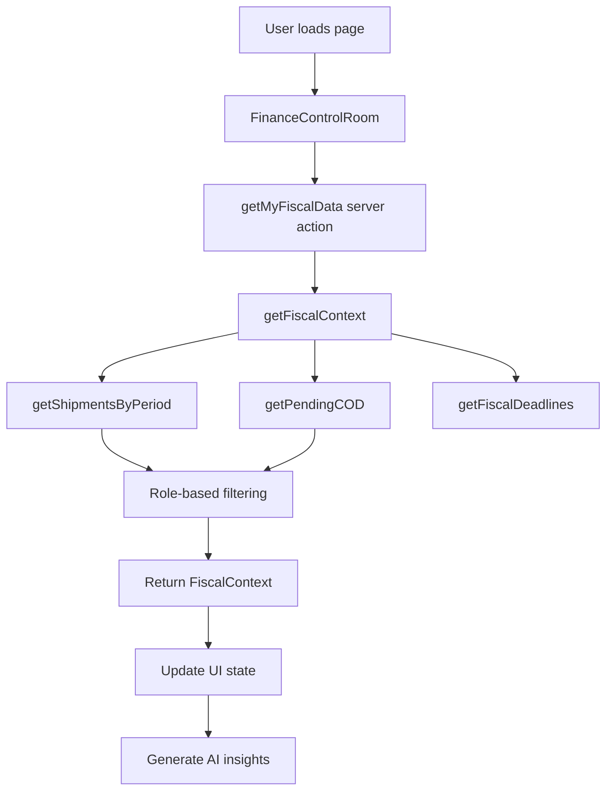

# Finance Control Room - Enterprise Fiscal Control Page

## 📊 Overview

La **Finance Control Room** è una dashboard enterprise-grade per il monitoraggio in tempo reale delle metriche fiscali e finanziarie. Integra AI-powered insights, role-based access control, e un knowledge base fiscale specializzato per il mercato italiano.

## ✨ Features

### Core Features

- ✅ **Real-time Metrics Dashboard** - KPI cards con margini, proiezioni e ROI
- ✅ **AI-Powered Insights** - ANNE AI fornisce analisi contestuali in tempo reale
- ✅ **Interactive AI Chat** - Dialogo con ANNE per consulenze fiscali
- ✅ **Fiscal Calendar** - Calendario scadenze italiane (F24, LIPE, IVA)
- ✅ **Cash Flow Monitoring** - Tracking contrassegni (COD) pendenti
- ✅ **Role-Based Access** - Dati filtrati per user/admin/reseller/superadmin
- ✅ **Error Boundaries** - Gestione errori robusta con fallback UI
- ✅ **Type Safety** - Full TypeScript con types esportati
- ✅ **Fiscal Health Check** - Monitor plafond export, regime forfettario, rischi

### Technical Features

- ✅ **Server Actions** - Next.js 15 server actions per data fetching
- ✅ **Comprehensive Testing** - Unit tests per tutti i moduli
- ✅ **Error Handling** - Custom error types con context
- ✅ **Knowledge Base** - Fiscal brain con 6+ scenari decisionali
- ✅ **Accessibility** - ARIA labels e keyboard navigation
- ✅ **Responsive Design** - Mobile-first con breakpoints tailwind
- ✅ **Performance** - Lazy loading e ottimizzazioni render

## 🏗️ Architecture

```
app/dashboard/finanza/
├── page.tsx                              # Main component (wrapped in ErrorBoundary)
├── _components/
│   ├── fiscal-error-boundary.tsx         # Error boundary component
│   └── ai-chat-dialog.tsx                # AI chat modal
└── README.md                             # This file

app/actions/
└── fiscal.ts                             # Server actions

lib/agent/
├── fiscal-data.ts                        # Business logic & data fetching
└── fiscal-data.types.ts                  # TypeScript definitions

lib/knowledge/
└── fiscal_brain.ts                       # AI knowledge base

tests/unit/
├── fiscal-control.test.tsx               # Component tests
├── fiscal-data.test.ts                   # Business logic tests
└── fiscal-brain.test.ts                  # Knowledge base tests
```

## 🔧 Usage

### Basic Usage

```tsx
import FinanceControlRoom from '@/app/dashboard/finanza/page';

// Component auto-wrapped in FiscalErrorBoundary
<FinanceControlRoom />;
```

### Server Actions

```typescript
import { getMyFiscalData } from '@/app/actions/fiscal';

// Fetch fiscal data for current user
const fiscalContext = await getMyFiscalData();
// Returns: FiscalContext with shipments, wallet, COD, deadlines
```

### Type-Safe Data Access

```typescript
import type { FiscalContext, UserRole } from '@/lib/agent/fiscal-data.types';

const context: FiscalContext = {
  userId: 'user-123',
  role: 'user',
  period: { start: '2026-01-01', end: '2026-01-31' },
  wallet: { balance: 1500.50 },
  shipmentsSummary: {
    count: 25,
    total_margin: 2840.50,
    total_revenue: 12450.00
  },
  pending_cod_count: 5,
  pending_cod_value: 450.00,
  deadlines: [...]
};
```

### Fiscal Brain Consultation

```typescript
import { consultFiscalBrain } from '@/lib/knowledge/fiscal_brain';

const userQuery = "Devo fare export UK, come gestisco l'IVA?";
const expertAdvice = consultFiscalBrain(userQuery);
// Returns relevant scenarios from knowledge base
```

## 🎯 Role-Based Access Control

| Role           | Access Level                         |
| -------------- | ------------------------------------ |
| **User**       | Own shipments only                   |
| **Admin**      | Own shipments + aggregated analytics |
| **Reseller**   | Own + sub-users' shipments           |
| **SuperAdmin** | Full platform visibility             |

## 📊 Data Flow



## 🧪 Testing

### Run Tests

```bash
# Run all fiscal control tests
npm run test:unit -- tests/unit/fiscal-control.test.tsx
npm run test:unit -- tests/unit/fiscal-data.test.ts
npm run test:unit -- tests/unit/fiscal-brain.test.ts

# Run with coverage
npm run test:coverage
```

### Test Coverage

- **Component Tests** - UI rendering, data loading, error handling
- **Business Logic Tests** - Data fetching, role filtering, calculations
- **Knowledge Base Tests** - Scenario matching, risk levels, categories

## 🚀 Future Enhancements

### Planned Features (Nice-to-Have)

- [ ] **Real-time WebSocket** - Live updates for metrics
- [ ] **Chart Visualization** - Recharts integration for analytics
- [ ] **Payment Integration** - "Paga Ora" button connected to Stripe
- [ ] **Data Caching** - SWR/React Query for performance
- [ ] **Export Functionality** - PDF/Excel report generation
- [ ] **Multi-language** - i18n support (currently Italian only)
- [ ] **Dark/Light Theme** - Theme switcher (currently dark only)
- [ ] **Advanced Filters** - Date range picker, custom periods
- [ ] **Notifications** - Real-time alerts for deadlines
- [ ] **Historical Trends** - Multi-period comparison charts

## 🔐 Security

- ✅ Row-Level Security (RLS) policies enforced at database level
- ✅ Server actions with authentication checks
- ✅ Role-based query filtering
- ✅ Input validation with Zod schemas (where applicable)
- ✅ Error messages sanitized (no sensitive data leaked)

## 📝 Best Practices

### When to use this page

- Monthly fiscal reviews
- Tax deadline monitoring
- Cash flow analysis
- AI-powered fiscal consultation

### Performance Considerations

- Data fetched once on mount (consider SWR for real-time)
- AI insights generated client-side from cached data
- Lazy load AI chat dialog
- Optimize re-renders with React.memo if needed

### Error Handling

- All database errors caught and typed
- User-friendly error messages
- Error boundary prevents full page crash
- Toast notifications for non-critical errors

## 🤝 Contributing

### Adding New Fiscal Scenarios

Edit `/lib/knowledge/fiscal_brain.ts`:

```typescript
export const FISCAL_BRAIN: FiscalScenario[] = [
  // ... existing scenarios
  {
    id: 'NEW_SCENARIO_ID',
    category: 'VAT' | 'CUSTOMS' | 'STRATEGY' | 'COMPLIANCE',
    trigger_condition: 'When X happens...',
    expert_advice: 'You should do Y because...',
    actionable_step: 'Step-by-step action',
    risk_level: 'LOW' | 'MEDIUM' | 'HIGH' | 'CRITICAL',
  },
];
```

### Adding New Metrics

1. Update `FiscalContext` type in `fiscal-data.types.ts`
2. Add data fetching logic in `getFiscalContext()`
3. Update UI in `page.tsx` to display new metric
4. Add tests for new functionality

## 📚 References

- **Next.js Server Actions**: https://nextjs.org/docs/app/building-your-application/data-fetching/server-actions
- **TypeScript**: https://www.typescriptlang.org/docs/
- **Vitest Testing**: https://vitest.dev/guide/
- **Italian Fiscal Calendar**: https://www.agenziaentrate.gov.it/

## 📄 License

Internal SpedireSicuro Platform - Proprietary

---

**Version**: 1.0.0
**Last Updated**: 2026-01-14
**Maintained by**: Engineering Team
