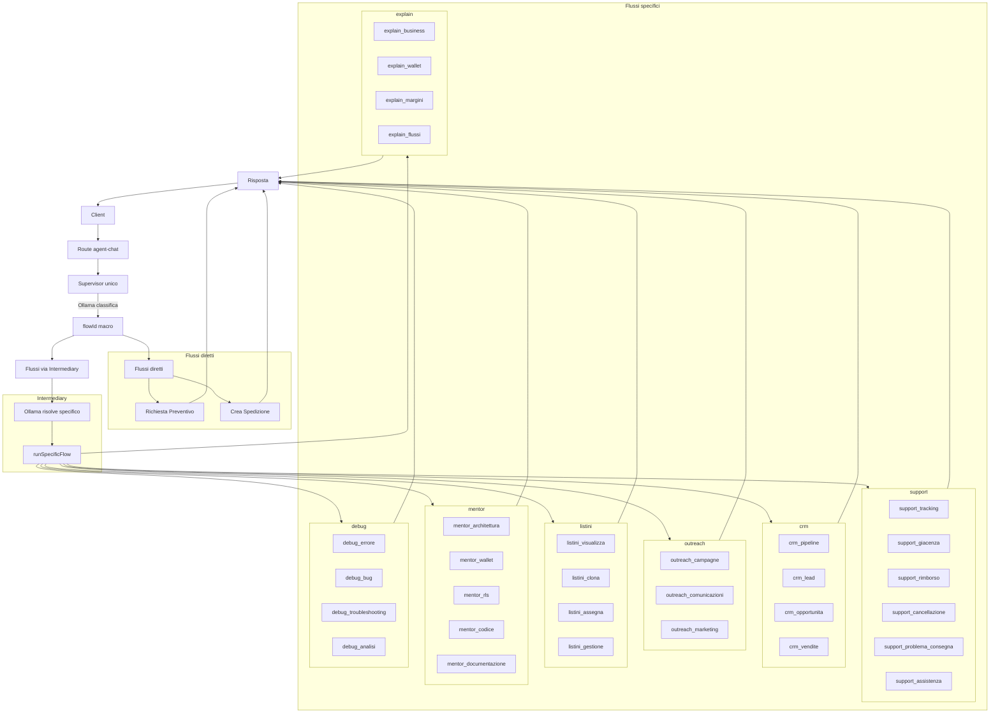
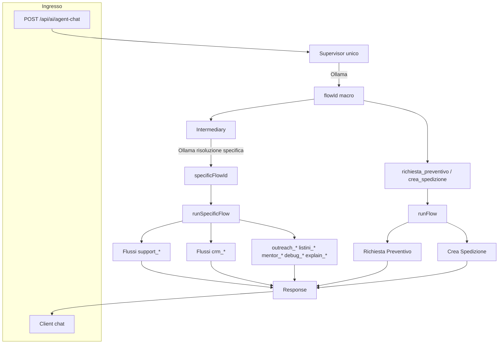
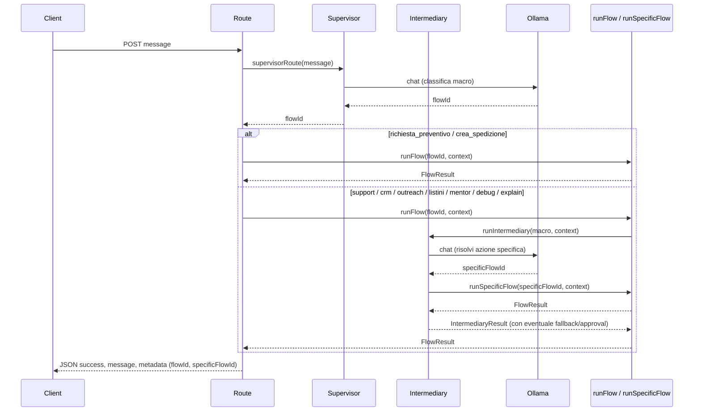

# Architettura Anne – Finale

Unico modello: **Ollama** (OLLAMA_BASE_URL, OLLAMA_MODEL). Nessuna chat generale: ogni messaggio viene classificato in un flusso. Per support, crm, outreach, listini, mentor, debug, explain il Supervisor restituisce un **macro**; una figura di **Intermediary** risolve l’azione **specifica** e invoca il flusso dedicato (con fallback/approval se necessario).

---

## Diagramma Anne finale

---

## Grafico architettura

---

## Flusso dati (semplificato)

---

## Componenti

| Componente               | File                                      | Ruolo                                                                                                                                                                                                       |
| ------------------------ | ----------------------------------------- | ----------------------------------------------------------------------------------------------------------------------------------------------------------------------------------------------------------- |
| **Supervisor**           | `lib/agent/supervisor.ts`                 | Classifica il messaggio con Ollama in un solo **macro** flowId. Nessun grafo, nessun nodo.                                                                                                                  |
| **Intermediary**         | `lib/agent/intermediary.ts`               | Solo per macro support/crm/outreach/listini/mentor/debug/explain: risolve con Ollama l’**azione specifica**, invoca `runSpecificFlow`, gestisce fallback (validazione fallita) e richieste di approvazione. |
| **runFlow**              | `lib/agent/flows/run-flow.ts`             | Se flowId è richiesta_preventivo o crea_spedizione → flusso diretto; se macro con specifici → delega a `runIntermediary`.                                                                                   |
| **runSpecificFlow**      | `lib/agent/flows/run-specific-flow.ts`    | Esegue un singolo flusso specifico (es. support_tracking, crm_lead); ogni azione ha un flowId dedicato.                                                                                                     |
| **Specific flowIds**     | `lib/agent/specific-flows.ts`             | Elenco di tutti i `specificFlowId` e mappa macro → specifici.                                                                                                                                               |
| **Richiesta Preventivo** | `lib/agent/flows/richiesta-preventivo.ts` | Ollama estrae peso, CAP, provincia; se completi → pricing engine; altrimenti chiarimento.                                                                                                                   |
| **Crea Spedizione**      | `lib/agent/workers/shipment-creation/`    | Catena esistente (validation workers → pricing → booking).                                                                                                                                                  |
| **Route**                | `app/api/ai/agent-chat/route.ts`          | Auth, rate limit, `supervisorRoute` → `runFlow(flowId)` → risposta JSON (metadata può includere `specificFlowId`).                                                                                          |

---

## FlowId macro (Supervisor)

- `richiesta_preventivo`
- `crea_spedizione`
- `support`
- `crm`
- `outreach`
- `listini`
- `mentor`
- `debug`
- `explain`

In caso di errore di classificazione Ollama, il Supervisor restituisce `support` come default.

---

## Flussi specifici (per macro)

Ogni macro support/crm/outreach/listini/mentor/debug/explain viene risolta dall’Intermediary in **un’azione specifica**. Ogni azione ha un flusso dedicato.

| Macro        | Flussi specifici                                                                                                           |
| ------------ | -------------------------------------------------------------------------------------------------------------------------- |
| **support**  | support_tracking, support_giacenza, support_rimborso, support_cancellazione, support_problema_consegna, support_assistenza |
| **crm**      | crm_pipeline, crm_lead, crm_opportunita, crm_vendite                                                                       |
| **outreach** | outreach_campagne, outreach_comunicazioni, outreach_marketing                                                              |
| **listini**  | listini_visualizza, listini_clona, listini_assegna, listini_gestione                                                       |
| **mentor**   | mentor_architettura, mentor_wallet, mentor_rls, mentor_codice, mentor_documentazione                                       |
| **debug**    | debug_errore, debug_bug, debug_troubleshooting, debug_analisi                                                              |
| **explain**  | explain_business, explain_wallet, explain_margini, explain_flussi                                                          |

---

## Note operative

- **WhatsApp** usa lo stesso flusso: webhook `/api/webhooks/whatsapp` chiama `supervisorRoute()` e `runFlow()` come la route web; la risposta viene formattata per WhatsApp (testo, card prezzi, booking).
- **Endpoint e test legacy** sono stati rimossi: `/api/anne/chat`, `/api/dev/test-anne-shipment`, modulo `supervisor-router`, pricing-graph e nodo supervisor dell’orchestrator. L’unico entry point è `supervisorRoute` + `runFlow` (+ Intermediary per i macro).
