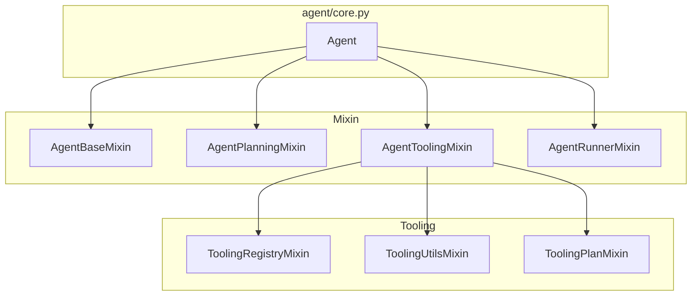
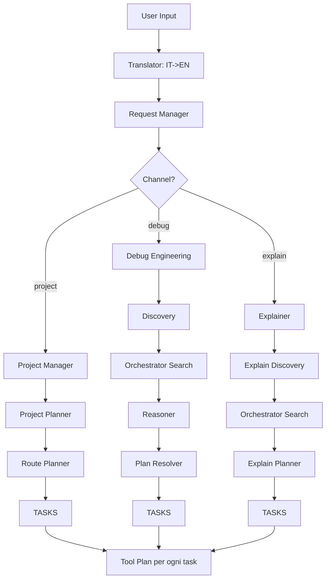
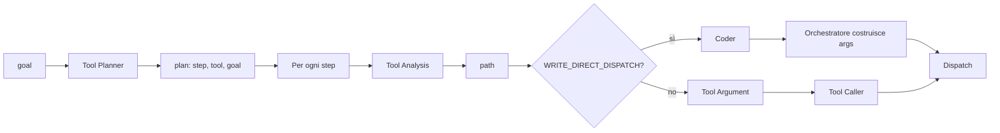

# Architettura AGENTE ANYA

Documentazione completa dell'architettura del progetto, pensata per sviluppatori e IA che lavorano sul codice.

---

## 1. Panoramica

**AGENTE ANYA** è un agente AI locale con interfaccia grafica Qt che risponde a richieste in linguaggio naturale su file, codice e progetti. L'utente invia una richiesta testuale; l'agente la classifica, genera un piano di task ed esegue tool (lettura file, scrittura, ricerca, pytest, ecc.) fino a produrre un risultato finale.

### Stack tecnologico

- **Python 3.x**
- **PySide6** per l'interfaccia Qt
- **Ollama** come backend LLM locale (modelli via API HTTP)
- **tools** custom per filesystem, Python (AST, pytest, ruff, mypy), git

### Flusso generale

```
User input -> Traduzione (IT->EN) -> Classificazione canale -> Generazione tasks ->
Esecuzione Tool Plan (per ogni task) -> Summary finale -> Traduzione (EN->IT)
```

I canali sono: **project** (creazione/estensione), **debug** (fix bug), **explain** (spiegazioni).

---

## 2. Architettura modulare

L'`Agent` è composto da mixin; ogni mixin ha responsabilità ben definite.

### Diagramma dei moduli



### Moduli e responsabilità

| Modulo | File | Responsabilità |
|--------|------|----------------|
| **Agent** | [agent/core.py](agent/core.py) | Compone i quattro mixin. Nessuna logica propria. |
| **AgentBaseMixin** | [agent/agent_base.py](agent/agent_base.py) | Client Ollama per ogni ruolo (planner, coder, reasoner, ecc.), `_chat_text`, `_tool_names`, index `.index/index.json`, traduzione IT/EN. |
| **AgentPlanningMixin** | [agent/agent_planning.py](agent/agent_planning.py) | Validazione/normalizzazione piani JSON: `_validate_plan`, `_validate_tool_call`, `_normalize_tool_name`, `_filter_task_plan`. |
| **AgentToolingMixin** | [agent/agent_tooling.py](agent/agent_tooling.py) | Assembla `ToolingRegistryMixin`, `ToolingUtilsMixin`, `ToolingPlanMixin`. |
| **AgentRunnerMixin** | [agent/agent_runner.py](agent/agent_runner.py) | `run()`, classificazione richiesta, tre canali, summary gerarchico, `_run_orchestrator_search`. |
| **ToolingRegistryMixin** | [agent/tooling_registry.py](agent/tooling_registry.py) | Definizione di tutti i tool con `ToolDef` (nome, descrizione, parametri, requires_approval). |
| **ToolingPlanMixin** | [agent/tooling_plan.py](agent/tooling_plan.py) | `_run_tool_plan`: orchestrazione Tool planner -> Tool analysis -> Coder / tool_caller -> dispatch. Post-write pipeline (ruff, mypy, debugger). |
| **ToolingUtilsMixin** | [agent/tooling_utils.py](agent/tooling_utils.py) | Utilities: `_extract_paths`, `_build_coder_payload`, `_get_format_instruction_for_path`, `_extract_content_literal`, ecc. |
| **prompts** | [agent/prompts.py](agent/prompts.py) | Tutti i prompt di sistema per ogni ruolo LLM. |
| **ToolRegistry** | [tools/registry.py](tools/registry.py) | `ToolDef` (dataclass), `ToolRegistry` (specs, dispatch). |
| **SystemTools** | [tools/system_tools.py](tools/system_tools.py) | Implementazione tool filesystem: read_file, write_file, safe_write, replace_text, search_text, list_dir, ecc. |
| **PythonTools** | [tools/python_tools.py](tools/python_tools.py) | Implementazione tool Python: python_exec, pytest_run, ruff_check, mypy_check, ast_outline, ecc. |
| **indexer** | [tools/indexer.py](tools/indexer.py) | Indicizzazione workdir: files, py_symbols (classi, funzioni). Output in `.index/index.json`. |
| **OllamaClient** | [api/ollama_client.py](api/ollama_client.py) | Client HTTP per Ollama. Delay tra request (`OLLAMA_REQUEST_DELAY`), retry su errori 5xx. |

---

## 3. I tre canali

La classificazione avviene tramite **Request Manager** (REQUEST_MANAGER_PROMPT). Output: `{"channel": "project"|"debug"|"explain", "reason": "..."}`.

### Diagramma flusso canali



### Channel project

**Scopo**: implementazione di nuovi progetti, nuove feature, nuovi moduli. L'utente vuole **creare** o **aggiungere** qualcosa.

**Flusso**:
1. **Project Manager**: trasforma la richiesta in piano testuale (bullet points + summary + note).
2. **Project Planner**: riceve workdir context (`ALLOWED_WORKDIR`, `WORKDIR FILES` con classi/funzioni e content preview). Output: `{"plan": [{"step", "goal", "module"}]}`. Ogni `module` deve essere un path in `allowed_paths`. Plan Enhancer e Function Planner sono **disabilitati**.
3. **Route Planner**: produce struttura directory-file e associazioni (opzionale per i task attuali).
4. **Tasks**: ogni punto del piano diventa un task `{step, goal}`.

**Workdir**: `_path_in_scope()`, `_build_workdir_context_for_project_planner()`. I path fuori scope vengono filtrati/remappati.

### Channel debug

**Scopo**: correzione bug, risoluzione errori. L'utente ha un errore o bug da **fixare**.

**Flusso**:
1. **Debug Engineering**: normalizza la richiesta in un goal coerente.
2. **Discovery**: estrae elementi da cercare (file, funzioni, variabili). Output: `{"elements": [{"type": "file|function|variable|...", "search": "..."}]}`.
3. **Orchestrator Search**: `_run_orchestrator_search()` cerca in `repo_index_light` (files, py_symbols) e usa `search_text` come fallback. Restituisce `collected`.
4. **Reasoner**: riceve `request` e `material` (ridotto: deduplica per path, max 600 char/file). Analizza e produce indicazioni sulla fix. **Retry** se output strip < 30 caratteri (max 3 tentativi).
5. **Plan Resolver**: riceve `reasoner_output`, `collected`, `request`. Produce piano minimale 1–3 task. **Non** aggiungere step "open file", "locate", "search". Ogni goal deve includere path e, per sostituzioni letterali, stringhe esatte "replace X with Y".

### Channel explain

**Scopo**: spiegazioni, analisi, comprensione del codice. L'utente vuole **capire** qualcosa.

**Flusso**:
1. **Explainer**: normalizza la richiesta in forma coerente.
2. **Explain Discovery**: determina elementi da cercare (funzioni, variabili, file).
3. **Orchestrator Search**: come per debug.
4. **Explain Planner**: formalizza piano numerato collegando la richiesta ai found elements. Output: `{"tasks": [{"step", "goal", "element_ref"}]}`.

---

## 4. Tool flow e orchestrazione

Dopo che un canale produce `tasks`, ogni task viene eseguito tramite `_run_tool_plan(request, repo_index_light, prior_context)`.

### Diagramma Tool Plan



### Ruoli

| Ruolo | Input | Output | Note |
|-------|-------|--------|------|
| **Tool Planner** | `tools` (array `{name, description}`), `goal` | `{"plan":[{"step", "tool", "goal"}]}` | Non include argomenti. Usa PLANNER_PROMPT. `python_exec` non è nella lista tools. |
| **Tool Analysis** | tool spec, goal, workspace_files, repo_index | `{"path":"..."}` | Sceglie il path. Usa TOOL_ANALYSIS_PROMPT. |
| **Coder** | goal, path, file_content, format_instruction, ecc. | content / diff / JSON old+new | Per tool di scrittura in WRITE_DIRECT_DISPATCH. |
| **Tool Argument** | tool spec, goal, path, args_template | args parziali | Per tool non in WRITE_DIRECT_DISPATCH. |
| **Tool Caller** | tool spec, args, required, example | `{"tool", "args"}` | Solo per tool che non sono in WRITE_DIRECT_DISPATCH. |

### WRITE_DIRECT_DISPATCH

Questi tool **non** passano per tool_caller. Path da tool_analysis, contenuto da coder, orchestratore costruisce args e fa dispatch diretto.

```
WRITE_DIRECT_DISPATCH = {safe_write, write_file, apply_patch_unified, apply_write_preview, replace_text}
```

| Tool | Coder output | Args iniettati |
|------|--------------|----------------|
| **safe_write** | full file content | path, content, dry_run |
| **write_file** | full file content | path, content |
| **apply_patch_unified** | unified diff | diff |
| **apply_write_preview** | (da preview_write) | path, content, expected_old_hash |
| **replace_text** | JSON `{"old":"...", "new":"..."}` | path, old, new |

**replace_text**: il coder produce esattamente `{"old": "exact text to replace", "new": "replacement"}`. L'orchestrazione fa il parse e inietta.

**python_exec**: non è tra i tool del planner. Viene gestito automaticamente dopo modifiche al codice (es. per eseguire test).

### Altri tool (tool_argument + tool_caller)

Per `read_file`, `pytest_run`, `search_text`, ecc.: tool_analysis fornisce il path; tool_argument + tool_caller completano gli args; l'orchestrazione fa dispatch.

### Workdir enforcement

Per i write tool, il `selected_path` da tool_analysis deve essere in `workspace_files`. Altrimenti: `ERROR: Path X fuori dalla workdir`.

---

## 5. Post-write pipeline

Dopo ogni scrittura su file `.py`, viene eseguita:

1. **ruff check --fix** (linter)
2. **ruff format** (formatter)
3. **mypy** (type checker)

Se mypy fallisce:
- Loop con **CODER_DEBUGGER_PROMPT** (max 3 retry)
- Per ogni file affetto: fix via coder -> safe_write -> ripeti mypy

---

## 6. Prompts

Tutti i prompt sono in [agent/prompts.py](agent/prompts.py).

| Costante | Ruolo | Scopo |
|----------|-------|-------|
| REQUEST_MANAGER_PROMPT | request_manager | Classificazione project/debug/explain |
| DEBUG_ENGINEERING_PROMPT | debugger | Normalizzazione goal per debug |
| DISCOVERY_PROMPT | discovery | Estrazione elementi da cercare (debug) |
| REASONER_PROMPT | reasoner | Analisi problema e indicazioni fix |
| PLAN_RESOLVER_PROMPT | plan_resolver | Piano risolutivo minimale da reasoner + collected |
| PROJECT_PLANNER_PROMPT | project_planner | Piano JSON con step, goal, module (workdir scope) |
| ROUTE_PLANNER_PROMPT | route_planner | Struttura directory-file |
| EXPLAINER_PROMPT | explainer | Normalizzazione richiesta explain |
| EXPLAIN_DISCOVERY_PROMPT | explain_discovery | Elementi da cercare (explain) |
| EXPLAIN_PLANNER_PROMPT | explain_planner | Piano numerato explain |
| PLANNER_PROMPT | planner | Scelta tool per ogni step (Tool Planner) |
| PLANNER_STRICT_PROMPT | planner | Retry strict |
| TOOL_ANALYSIS_PROMPT | tool_analysis | Scelta path |
| TOOL_ARGUMENT_PROMPT | tool_argument | Compilazione args |
| TOOL_CALLER_PROMPT | tool | Output JSON tool + args |
| TOOL_CALLER_STRICT_PROMPT | tool | Retry strict |
| CODER_PROMPT | coder | Unified diff (apply_patch_unified) |
| CODER_CONTENT_PROMPT | coder | Full file content (safe_write, write_file) |
| CODER_REPLACE_PROMPT | coder | JSON old/new (replace_text) |
| CODER_ENV_PROMPT | coder | File .env |
| CODER_YAML_PROMPT | coder | File YAML |
| CODER_DEBUGGER_PROMPT | debugger | Fix errori mypy |
| FINAL_PROMPT | final | Risposta finale per task |
| FINAL_SUMMARY_PROMPT | summary | Summary da task_evidence |
| INTERMEDIATE_SUMMARY_PROMPT | summary | Summary chunk intermedio |
| MERGE_SUMMARY_PROMPT | summary | Merge summary finale |

---

## 7. Tool registry

Elenco completo dei tool definiti in [agent/tooling_registry.py](agent/tooling_registry.py).

### File system

| Tool | Required | requires_approval | Descrizione |
|------|----------|-------------------|-------------|
| list_dir | path | no | Elenca file e cartelle |
| count_dir | path | no | Conta file e cartelle |
| read_file | path | no | Legge un file di testo |
| read_file_lines | path, start_line, end_line | no | Legge un range di righe |
| search_text | path, pattern | no | Cerca stringa nei file (letterale, re.escape) |
| search | path, pattern | no | Alias di search_text |
| stat_path | path | no | Info file/directory |
| stat | path | no | Alias di stat_path |
| preview_write | path, content | no | Mostra diff senza scrivere |
| apply_write_preview | path, content, expected_old_hash | sì | Applica write con hash |
| safe_write | path, content | sì | Scrive contenuto completo (orchestrazione inietta content) |
| apply_patch_unified | diff | sì | Applica unified diff |
| write_file | path, content | sì | Scrive file |
| append_file | path, content | sì | Appende a file |
| replace_text | path, old, new | sì | Sostituisce stringa esatta (orchestrazione inietta old/new) |
| replace_in_repo | root, old, new | sì | Sostituisce in repo |
| insert_text | path, line_no, text | sì | Inserisce testo a riga |
| delete_path | path | sì | Elimina file/directory |
| move_path | src, dest | sì | Sposta/rinomina |
| copy_path | src, dest | sì | Copia |
| mkdir | path | no | Crea directory |
| glob_paths | pattern | no | Espande glob |
| file_hash | path | no | Hash file |
| run_command | command | sì | Esegue comando |

### Git

| Tool | Required | requires_approval |
|------|----------|-------------------|
| git_status | - | no |
| git_diff | - | no |
| git_log | - | no |

### Python

| Tool | Required | requires_approval |
|------|----------|-------------------|
| python_exec | code | sì |
| python_ast_outline | path | no |
| python_ast_imports | path | no |
| python_ast_find | path | no |
| python_project_deps | root | no |
| python_project_deps_toml | root | no |
| python_run_file | path | sì |
| pip_list | - | no |
| pip_install | package | sì |
| pytest_run | - | sì |
| ruff_check | - | sì |
| mypy_check | - | sì |

**Nota**: `python_exec` non è nella lista `tools` passata al Tool Planner; è gestito dal sistema (es. post-write, test automatici).

---

## 8. Configurazione e ambiente

### config.json

- `ollama_host`: URL Ollama (es. `http://localhost:11434`)
- `ollama_model`: modello base
- `ollama_planner_model`, `ollama_task_planner_model`, `ollama_tool_model`, `ollama_coder_model`, `ollama_debugger_model`, `ollama_final_model`, `ollama_summary_model`, `ollama_translator_model`
- `ollama_request_manager_model`, `ollama_project_manager_model`, `ollama_project_planner_model`, `ollama_route_planner_model`
- `ollama_discovery_model`, `ollama_reasoner_model`, `ollama_plan_resolver_model`
- `ollama_explainer_model`, `ollama_explain_discovery_model`, `ollama_explain_planner_model`
- `ollama_tool_analysis_model`, `ollama_tool_argument_model`
- `base_dir`: directory di lavoro

### Variabili d'ambiente

- **OLLAMA_REQUEST_DELAY**: secondi di pausa tra ogni richiesta Ollama (default 2). Impostata anche in [main.py](main.py).

### base_dir

Usata da `SystemTools` e `indexer`. Tutti i path sono relativi a base_dir. L'indexer popola `.index/index.json` con `files` e `py_symbols`.

---

## 9. Eventi e yield

`Agent.run()` è un generatore che emette `(kind, text)`:

| kind | Significato |
|------|-------------|
| SYS | Messaggio di sistema |
| USER | Input utente |
| TRANSLATED_CLEAN | Testo tradotto in inglese |
| REQUEST_MANAGER_RAW | Output grezzo Request Manager |
| TASK_PLAN | Piano task (JSON) |
| PLAN | Piano tool (JSON) |
| TOOL | Chiamata tool (nome + args) |
| TOOL_RESULT | Risultato tool |
| TOOL_ANALYSIS_PROMPT | Payload tool analysis |
| TOOL_CALLER_RAW | Output tool caller |
| CODER_RAW | Output coder |
| REQUEST_APPROVAL | Richiesta autorizzazione (JSON con name, args) |
| ERROR | Errore |
| MODEL_TOKEN | Token output modello (streaming) |
| TOKEN_USAGE | Statistiche token |
| ATTEMPT | Contatore tentativi |

[main.py](main.py): `AgentWorker` consuma gli eventi. Su `REQUEST_APPROVAL` mostra UI per approvare/rifiutare; il risultato viene passato a `approval_handler`.

---

## 10. Test

- [tests/run_tests.py](tests/run_tests.py): test automatici con prompt fissi. Può essere invocato con uno o più nomi di test (es. `channel_project`, `channel_debug`, `channel_explain`).
- [TESTS_CHANNELS.md](TESTS_CHANNELS.md): documentazione dei test dei tre canali.

### Fixture principali

| Test | Fixture | Descrizione |
|------|---------|-------------|
| channel_project | channel_project_target.py | Modulo da creare/estendere |
| channel_debug | channel_debug_target.py, test_channel_debug.py, channel_debug_error.txt | Modulo con bug da correggere |
| channel_explain | channel_explain_target.py | Modulo da spiegare |

I log vengono scritti in `tests/test_channel_*.txt`.

---

## 11. Linee guida per IA che modificano il codice

### Aggiungere un tool

1. Definire in [agent/tooling_registry.py](agent/tooling_registry.py) con `ToolDef(name, description, parameters, func, requires_approval)`.
2. Se è un tool di scrittura e il contenuto viene dal coder:
   - Aggiungerlo a `WRITE_DIRECT_DISPATCH` in [agent/tooling_plan.py](agent/tooling_plan.py).
   - Implementare il blocco coder (payload, prompt, parsing) e l'iniezione args nel blocco `WRITE_DIRECT_DISPATCH`.
3. Se non è di scrittura: passerà automaticamente per tool_argument + tool_caller.

### Modificare un prompt

Tutti i prompt sono in [agent/prompts.py](agent/prompts.py). Citare sempre il nome della costante (es. `PLANNER_PROMPT`, `REASONER_PROMPT`).

### Cambiare la logica di un canale

- Project: `_run_project_channel()` in [agent/agent_runner.py](agent/agent_runner.py)
- Debug: `_run_debug_channel()` in [agent/agent_runner.py](agent/agent_runner.py)
- Explain: `_run_explain_channel()` in [agent/agent_runner.py](agent/agent_runner.py)

### Cambiare la scelta del tool

- `PLANNER_PROMPT` in [agent/prompts.py](agent/prompts.py)
- Descrizioni dei tool in [agent/tooling_registry.py](agent/tooling_registry.py): il planner riceve `{name, description}` per ogni tool

### Regole critiche

1. **Non** far passare tool di scrittura (safe_write, replace_text, write_file, apply_patch_unified, apply_write_preview) dal tool_caller. Usare sempre `WRITE_DIRECT_DISPATCH` e coder.
2. **Workdir**: i path per i write tool devono stare in `allowed_files` / `workspace_files`. Controllo in `tooling_plan.py` prima del dispatch.
3. **replace_text**: il coder deve produrre JSON `{"old": "...", "new": "..."}`. L'orchestrazione fa il parse.
4. **python_exec**: non è nella lista `tools` del planner; è gestito automaticamente. Non aggiungerlo alla lista.

### Dove cercare

| Obiettivo | File principale |
|-----------|-----------------|
| Aggiungere/modificare tool | agent/tooling_registry.py, agent/tooling_plan.py |
| Modificare prompt | agent/prompts.py |
| Modificare flusso canali | agent/agent_runner.py |
| Modificare validazione piani | agent/agent_planning.py |
| Modificare payload coder | agent/tooling_utils.py (`_build_coder_payload`) |
| Implementazione tool low-level | tools/system_tools.py, tools/python_tools.py |
