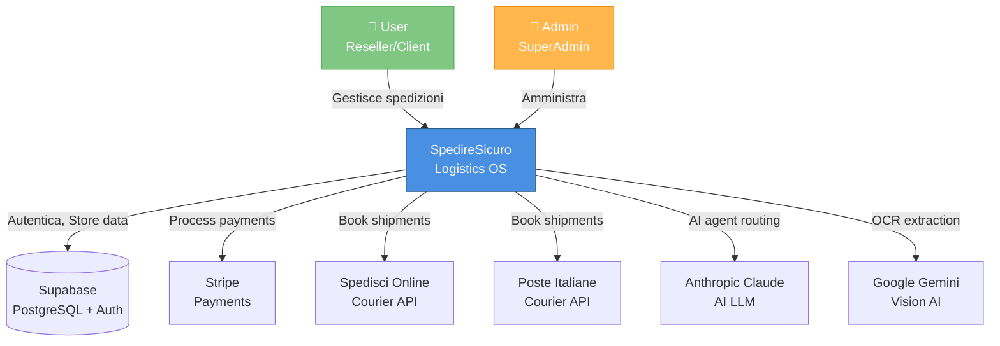
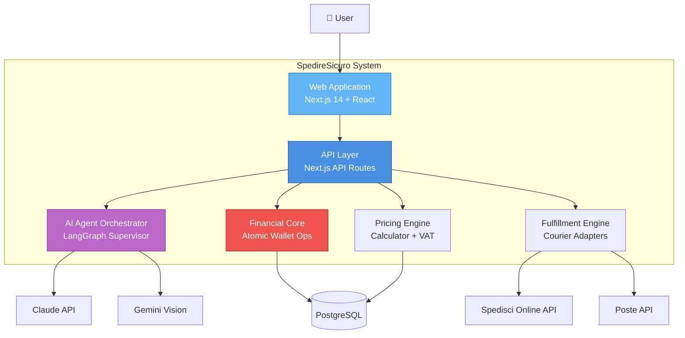
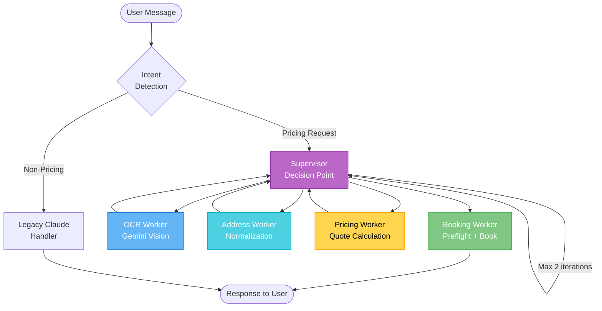
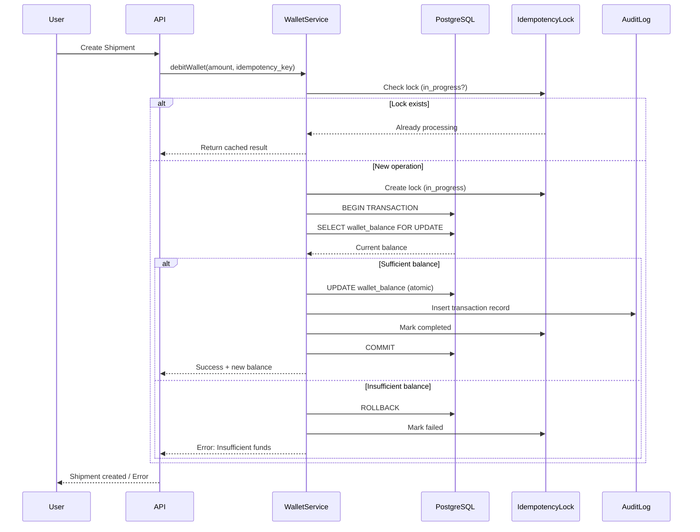
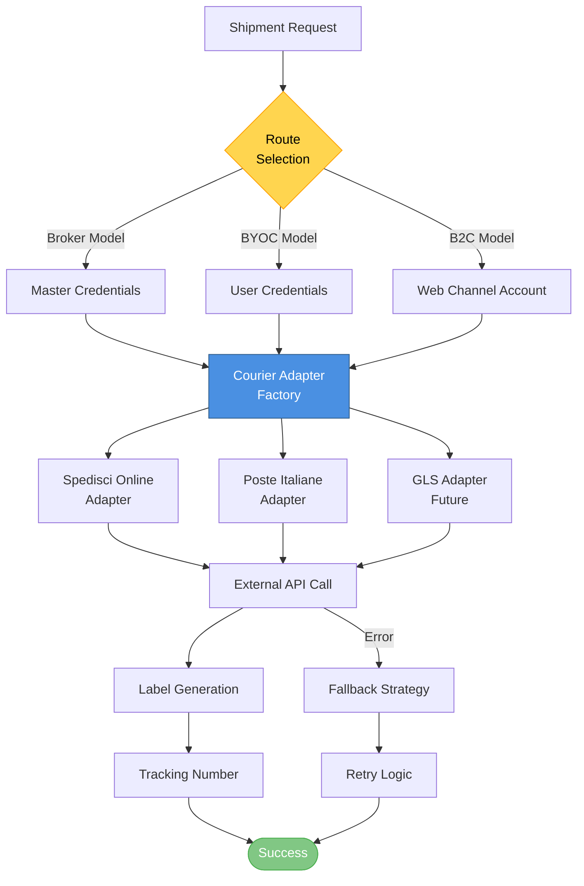
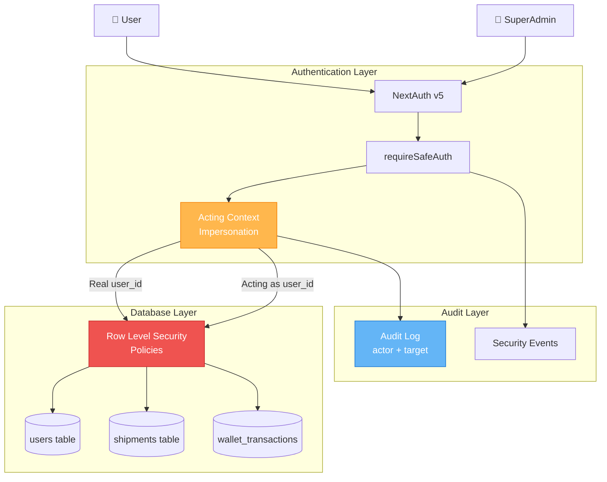
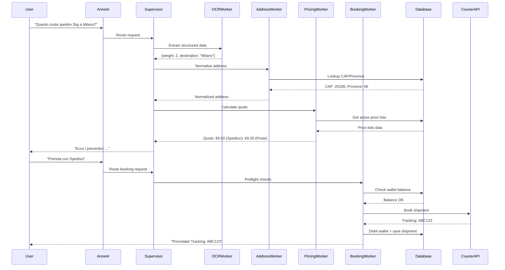
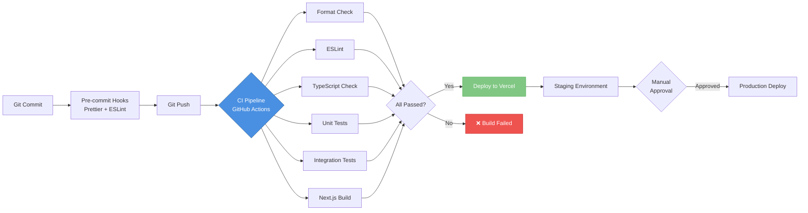

# Architecture Diagrams

Diagrammi architetturali del sistema SpedireSicuro usando [Mermaid](https://mermaid.js.org/).

---

## 📊 C4 Model - Level 1: System Context

---

## 📊 C4 Model - Level 2: Container Diagram

---

## 🤖 AI Agent Architecture (LangGraph Supervisor)

---

## 💰 Financial Core - Wallet System

---

## 🚚 Fulfillment Flow (Multi-Carrier)

---

## 🔒 Security Architecture (RLS + Acting Context)

---

## 📈 Data Flow: Pricing Request → Shipment

---

## 🔄 CI/CD Pipeline

---

## 📖 How to View These Diagrams

### GitHub

GitHub natively supports Mermaid rendering in markdown files. Just view this file on GitHub!

### VS Code

Install the [Mermaid Preview](https://marketplace.visualstudio.com/items?itemName=bierner.markdown-mermaid) extension.

### Online

Copy-paste the Mermaid code to [Mermaid Live Editor](https://mermaid.live/).

---

**Last Updated:** 2026-01-20
