# Architecture Diagrams

Diagrammi architetturali del sistema SpedireSicuro usando [Mermaid](https://mermaid.js.org/).

---

## 📊 C4 Model - Level 1: System Context

---

## 📊 C4 Model - Level 2: Container Diagram

---

## 🤖 AI Agent Architecture (LangGraph Supervisor)

---

## 💰 Financial Core - Wallet System

---

## 🚚 Fulfillment Flow (Multi-Carrier)

---

## 🔒 Security Architecture (RLS + Acting Context)

---

## 📈 Data Flow: Pricing Request → Shipment

---

## 🔄 CI/CD Pipeline

```mermaid
graph LR
    Commit[Git Commit] --> PreCommit[Pre-commit Hooks<br/>Prettier + ESLint]
    PreCommit --> Push[Git Push]
    Push --> CI{CI Pipeline<br/>GitHub Actions}

    CI --> FormatCheck[Format Check]
    CI --> Lint[ESLint]
    CI --> TypeCheck[TypeScript Check]
    CI --> UnitTests[Unit Tests]
    CI --> IntegrationTests[Integration Tests]
    CI --> Build[Next.js Build]

    FormatCheck --> Gate{All Passed?}
    Lint --> Gate
    TypeCheck --> Gate
    UnitTests --> Gate
    IntegrationTests --> Gate
    Build --> Gate

    Gate -->|Yes| Deploy[Deploy to Vercel]
    Gate -->|No| Fail[❌ Build Failed]

    Deploy --> Staging[Staging Environment]
    Staging --> Manual{Manual<br/>Approval}
    Manual -->|Approved| Production[Production Deploy]

    style CI fill:#4A90E2,stroke:#2E5C8A,color:#fff
    style Deploy fill:#81C784,stroke:#4CAF50,color:#fff
    style Fail fill:#EF5350,stroke:#C62828,color:#fff
```

---

## 📖 How to View These Diagrams

### GitHub

GitHub natively supports Mermaid rendering in markdown files. Just view this file on GitHub!

### VS Code

Install the [Mermaid Preview](https://marketplace.visualstudio.com/items?itemName=bierner.markdown-mermaid) extension.

### Online

Copy-paste the Mermaid code to [Mermaid Live Editor](https://mermaid.live/).

---

**Last Updated:** 2026-01-20
