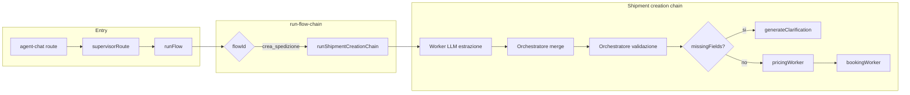

# Piano: crea spedizione – worker LLM + orchestratore unico

Questo documento integra il piano "Flusso crea spedizione e test" con l’architettura richiesta: **worker tutti LLM** (un compito + un prompt ciascuno), **orchestratore unico** per validazione, uso dati e chiamate a pricing/booking.

---

## Regola architetturale

- **Nessun worker rule-based** (niente regex, niente `normalize-it-address` nei worker).
- Ogni worker è un **LLM con un compito specifico e un prompt specifico**.
- **Validazione, uso dei dati e chiamate alle funzioni** (pricing, booking) li fa **solo l’orchestratore**.

---

## 3. Architettura obiettivo: worker LLM + orchestratore

### 3.1 Worker: tutti LLM, un compito + un prompt ciascuno

Sostituire i 7 worker in [lib/agent/workers/shipment-creation/validation-workers.ts](lib/agent/workers/shipment-creation/validation-workers.ts) con **worker LLM** che:

- **Input:** `message` utente + `existingDraft` (bozza già parziale dalla conversazione).
- **Compito:** uno solo per worker, descritto in un **prompt di sistema dedicato** (es. “Estrai solo nome mittente e nome destinatario dal messaggio; rispondi in JSON con chiavi senderName, recipientName”).
- **Output:** **strutturato (JSON)** così che l’orchestratore possa fare merge e validazione senza interpretare testo libero.

Esempi (un worker = una chiamata LLM + un prompt):

| Worker LLM             | Compito                                                | Output atteso (JSON)                               |
| ---------------------- | ------------------------------------------------------ | -------------------------------------------------- |
| **llmWorkerNomi**      | Estrarre nome mittente e nome destinatario             | `{ senderName?, recipientName? }`                  |
| **llmWorkerIndirizzo** | Estrarre indirizzo, città, CAP, provincia destinatario | `{ addressLine1?, city?, postalCode?, province? }` |
| **llmWorkerTelefoni**  | Estrarre telefono mittente e telefono destinatario     | `{ senderPhone?, recipientPhone? }`                |
| **llmWorkerPacco**     | Estrarre peso (kg) e opz. dimensioni (cm)              | `{ weightKg?, lengthCm?, widthCm?, heightCm? }`    |

**Alternativa:** un solo worker LLM “estrazione completa” con un unico prompt che restituisce un JSON allineato a `ShipmentDraft` (sender, recipient, parcel). Stessa regola: **zero regex/rule-based** nei worker; solo `chatWithOllama` / `getOllamaLLM` con prompt specifico e parsing JSON.

**File suggerito:** nuovo modulo `lib/agent/workers/shipment-creation/llm-extraction-workers.ts` (oppure sostituire la logica in `validation-workers.ts` mantenendo solo invocazione LLM + output draft parziale).

---

### 3.2 Orchestratore: validazione + uso dati + chiamate funzioni

L’orchestratore [lib/agent/workers/shipment-creation/chain.ts](lib/agent/workers/shipment-creation/chain.ts) deve:

1. **Invocare i worker LLM** (in sequenza o un unico “full extraction”) passando `message` e `existingDraft`, e raccogliere gli output JSON.
2. **Merge:** costruire un unico `ShipmentDraft` unendo `existingDraft` con i campi estratti dagli LLM (il merge lo fa l’orchestratore, non i worker).
3. **Validazione:** l’orchestratore controlla i campi obbligatori (es. lista `SHIPMENT_CREATION_REQUIRED_FIELDS`: sender.name, sender.phone, recipient.fullName, recipient.addressLine1, recipient.city, recipient.postalCode, recipient.province, recipient.phone, parcel.weightKg). Nessuna validazione rule-based nei worker; la validazione è **solo in chain** (es. “mancano questi campi” → missingFields).
4. **Decisione:**
   - Se `missingFields.length > 0`: l’orchestratore genera il messaggio di chiarimento (es. riuso di `generateClarificationFromMissingFields` o logica equivalente) e ritorna `clarification_request` + stato; **nessuna** chiamata a pricing/booking.
   - Se dati completi: l’orchestratore **usa i dati** (costruisce `stateWithDetails` da `updatedDraft`) e **chiama le funzioni**:
     - prima `pricingWorker(stateWithDetails, logger)`;
     - poi, se pricing ok, `bookingWorker(stateWithPricing, logger)`.
5. **Risultato:** come oggi (`shipmentDraft`, `missingFields`, `clarification_request` o `booking_result`, `agentState`).

In sintesi: **worker = solo LLM con compito e prompt specifico**. **Orchestratore = validazione + merge + uso dati + chiamata a pricing e booking.**

---

### 3.3 Cosa va rimosso / deprecato

- In [lib/agent/workers/shipment-creation/validation-workers.ts](lib/agent/workers/shipment-creation/validation-workers.ts): rimuovere **tutta** la logica rule-based (regex, `extractAddressDataFromText`, `extractPostalCode`, `extractFullName`, ecc. da `normalize-it-address` usata **dentro** i worker). Opzione: tenere il file solo per `SHIPMENT_CREATION_REQUIRED_FIELDS` e `getMissingFromDraft(draft)` se usati dall’orchestratore per la validazione, oppure spostare “required fields” e “get missing” in `chain.ts` o in un modulo `validation.ts` che non contiene estrazione, solo regole di completezza.
- La chain **non** deve più chiamare `runAllValidationWorkers` (rule-based); deve chiamare i nuovi worker LLM e poi fare validazione + merge in house.

---

### 3.4 Pricing e booking (invariati come “funzioni” chiamate dall’orchestratore)

- **Pricing:** [lib/agent/workers/pricing.ts](lib/agent/workers/pricing.ts) resta com’è: chiamata dall’orchestratore dopo che il draft è completo; nessun worker LLM per il pricing.
- **Booking:** [lib/agent/workers/booking.ts](lib/agent/workers/booking.ts) idem: chiamata dall’orchestratore dopo pricing; l’orchestratore passa i dati e la “chiamata funzione specifica” è proprio `bookingWorker(...)` / `callBookingAdapter(...)`.

---

## Diagramma flusso (dopo refactor)

---

## Todo implementazione

1. **llm-workers:** Sostituire i 7 worker rule-based con worker LLM (un compito + prompt specifico ciascuno), output strutturato JSON.
2. **orchestrator-validation:** Orchestratore: invoca worker LLM, valida campi obbligatori, merge draft, clarification o chiamata pricing/booking.
3. **remove-rule-based:** Rimuovere/deprecare validation-workers.ts rule-based e dipendenze da normalize-it-address nella chain.
