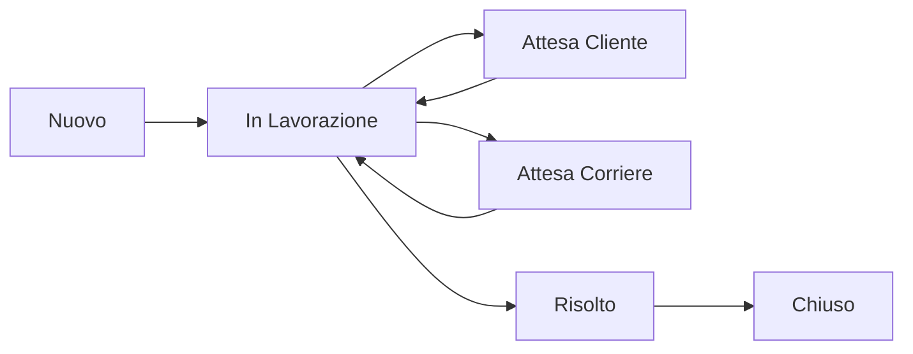

# Sistema di Assistenza SpedireSecuro

**Data Creazione:** 2026-02-01  
**Versione:** 1.0.0  
**Stato:** Implementato (da testare)

---

## Panoramica

Il **Sistema di Assistenza** è un modulo completo di ticketing e supporto clienti integrato in SpedireSecuro. Permette agli utenti di aprire ticket per problemi operativi e amministrativi, comunicare con gli operatori, e tracciare lo stato delle richieste.

### Caratteristiche Principali

- ✅ **Ticketing Completo**: Creazione, gestione e tracking ticket
- ✅ **Chat in Tempo Reale**: Conversazioni tra clienti e operatori
- ✅ **Multi-Tenant**: Isolamento dati con RLS
- ✅ **Categorie Multiple**: Spedizioni, giacenze, wallet, fatture, tecnico, configurazione
- ✅ **Priorità Gestibili**: Bassa, media, alta, urgente
- ✅ **Stati Workflow**: Nuovo → In Lavorazione → Risolto → Chiuso
- ✅ **Note Interne**: Comunicazioni private tra operatori
- ✅ **Allegati**: Upload file per documentazione
- ✅ **SLA Tracking**: Metriche tempo di risposta e risoluzione
- ✅ **Valutazioni**: Rating e feedback post-risoluzione
- ✅ **Audit Trail**: Log completo di tutte le azioni
- ✅ **Knowledge Base**: Articoli di supporto (struttura pronta)

---

## Architettura

### Database Schema

Il sistema utilizza **6 tabelle principali**:

1. **`support_tickets`** - Ticket di assistenza
2. **`support_messages`** - Messaggi e conversazioni
3. **`support_attachments`** - Allegati file
4. **`support_actions`** - Log azioni per audit
5. **`support_kb_articles`** - Knowledge base (futuro)
6. **`support_canned_responses`** - Risposte predefinite (futuro)

#### Ticket Number Format

I ticket hanno un numero univoco auto-generato:

```
TKT-YYYY-00001
```

Esempio: `TKT-2026-00001`

### Row Level Security (RLS)

Tutte le tabelle hanno **RLS abilitato** per garantire isolamento multi-tenant:

- **Clienti**: Vedono solo i propri ticket
- **Reseller**: Vedono ticket propri e dei sub-users
- **Operatori/Admin**: Vedono tutti i ticket
- **Note Interne**: Visibili solo a operatori

### Stati Ticket



---

## Struttura File

### Backend

```
supabase/migrations/
└── 20260201000000_support_system.sql    # Migration completa

types/
└── support.ts                            # TypeScript types

lib/
├── validations/
│   └── support.ts                        # Zod schemas
└── actions/
    └── support.ts                        # Server Actions
```

### Frontend

```
components/support/
├── TicketCard.tsx                        # Card lista ticket
├── TicketForm.tsx                        # Form creazione ticket
└── TicketChat.tsx                        # Chat messaggi

app/dashboard/assistenza/
├── page.tsx                              # Lista ticket cliente
├── nuovo/
│   └── page.tsx                          # Creazione ticket
└── [id]/
    └── page.tsx                          # Dettaglio ticket

app/dashboard/admin/assistenza/           # Dashboard operatori (da implementare)
```

---

## API Reference

### Server Actions

#### `createTicket(input: CreateTicketSchema)`

Crea un nuovo ticket di assistenza.

**Input:**
```typescript
{
  category: 'spedizione' | 'giacenza' | 'wallet' | 'fattura' | 'tecnico' | 'configurazione' | 'altro',
  priority?: 'bassa' | 'media' | 'alta' | 'urgente',
  subject: string,
  description: string,
  shipment_id?: string,
  invoice_id?: string,
  wallet_transaction_id?: string,
  tags?: string[]
}
```

**Output:**
```typescript
{
  success: boolean,
  data?: SupportTicket,
  error?: string
}
```

#### `updateTicket(ticketId: string, input: UpdateTicketSchema)`

Aggiorna un ticket esistente.

**Input:**
```typescript
{
  status?: TicketStatusType,
  priority?: TicketPriorityType,
  assigned_to?: string | null,
  rating?: number,
  feedback?: string,
  tags?: string[]
}
```

#### `getTickets(params?: TicketListParams)`

Ottiene lista ticket con filtri e paginazione.

**Input:**
```typescript
{
  page?: number,
  limit?: number,
  sort_by?: 'created_at' | 'updated_at' | 'priority',
  sort_order?: 'asc' | 'desc',
  status?: TicketStatusType | TicketStatusType[],
  category?: TicketCategoryType | TicketCategoryType[],
  priority?: TicketPriorityType | TicketPriorityType[],
  assigned_to?: string | null,
  search?: string
}
```

**Output:**
```typescript
{
  success: boolean,
  data?: {
    tickets: SupportTicketWithRelations[],
    total: number,
    page: number,
    limit: number,
    total_pages: number
  },
  error?: string
}
```

#### `getTicketDetail(ticketId: string)`

Ottiene dettaglio completo di un ticket.

**Output:**
```typescript
{
  success: boolean,
  data?: {
    ticket: SupportTicketWithRelations,
    messages: SupportMessageWithUser[],
    attachments: SupportAttachment[],
    actions: SupportAction[]
  },
  error?: string
}
```

#### `addMessage(input: CreateMessageSchema)`

Aggiunge un messaggio a un ticket.

**Input:**
```typescript
{
  ticket_id: string,
  message: string,
  is_internal?: boolean  // Solo per operatori
}
```

#### `submitRating(input: SubmitRatingSchema)`

Invia valutazione per un ticket risolto.

**Input:**
```typescript
{
  ticket_id: string,
  rating: number,  // 1-5
  feedback?: string
}
```

#### `getSupportStats(userId?: string)`

Ottiene statistiche ticket.

**Output:**
```typescript
{
  total_tickets: number,
  open_tickets: number,
  awaiting_customer: number,
  resolved_tickets: number,
  closed_tickets: number,
  avg_rating: number | null,
  urgent_tickets: number
}
```

#### `getSLAMetrics(days: number = 7)`

Ottiene metriche SLA.

**Output:**
```typescript
{
  avg_first_response_minutes: number | null,
  avg_resolution_hours: number | null,
  tickets_resolved_in_period: number,
  sla_compliance_rate: number | null
}
```

---

## Utilizzo

### Creare un Ticket da Codice

```typescript
import { createTicket } from '@/lib/actions/support';

const result = await createTicket({
  category: 'spedizione',
  priority: 'alta',
  subject: 'Spedizione non consegnata',
  description: 'La spedizione TRK123456 è in giacenza da 5 giorni...',
  shipment_id: 'uuid-spedizione',
});

if (result.success) {
  console.log('Ticket creato:', result.data.ticket_number);
}
```

### Aggiungere Messaggio

```typescript
import { addMessage } from '@/lib/actions/support';

const result = await addMessage({
  ticket_id: 'uuid-ticket',
  message: 'Ho verificato lo stato, la spedizione è in consegna oggi.',
  is_internal: false,
});
```

### Link da Spedizione a Ticket

Nel dettaglio spedizione, aggiungere:

```tsx
<Button asChild>
  <Link href={`/dashboard/assistenza/nuovo?shipment_id=${shipment.id}`}>
    Apri Ticket Assistenza
  </Link>
</Button>
```

---

## Integrazioni

### 1. Spedizioni

Il sistema si integra con le spedizioni tramite:

- **Riferimento diretto**: `ticket.shipment_id`
- **Link bidirezionale**: Da ticket a spedizione e viceversa
- **Azioni contestuali**: Cancellazione, tracking, download LDV

### 2. Giacenze

Azioni disponibili:

- **Riconsegna**: Con addebito automatico wallet
- **Reso**: Richiesta reso al mittente
- **Distruzione**: Richiesta distruzione merce

```typescript
import { requestGiacenzaRiconsegna } from '@/lib/actions/support';

const result = await requestGiacenzaRiconsegna({
  ticket_id: 'uuid-ticket',
  shipment_id: 'uuid-spedizione',
  action: 'riconsegna',
});
```

### 3. Wallet

Visualizzazione saldo e transazioni correlate nel ticket.

### 4. Notifiche Telegram

Il sistema è predisposto per notifiche Telegram (da implementare):

- Nuovo ticket → Notifica operatori
- Nuovo messaggio → Notifica utente/operatore
- Cambio stato → Notifica utente

---

## Dashboard Operatori

**Stato:** Da implementare

La dashboard operatori includerà:

- **Coda Ticket**: Ticket non assegnati
- **Miei Ticket**: Ticket assegnati all'operatore
- **Filtri Avanzati**: Per stato, priorità, categoria
- **Azioni Rapide**: Assegnazione, cambio stato, note interne
- **Metriche**: SLA compliance, tempo medio risoluzione
- **Knowledge Base**: Gestione articoli

### Route Prevista

```
/dashboard/admin/assistenza
```

---

## Knowledge Base

**Stato:** Struttura database pronta, UI da implementare

La Knowledge Base permetterà di:

- Creare articoli di supporto
- Categorizzare per argomento
- Full-text search in italiano
- Metriche visualizzazioni e utilità
- Suggerimenti automatici durante creazione ticket

---

## Metriche SLA

Il sistema traccia automaticamente:

- **First Response Time**: Tempo prima risposta operatore
- **Resolution Time**: Tempo totale risoluzione
- **SLA Compliance Rate**: % ticket risolti entro SLA
- **Customer Satisfaction**: Rating medio

### Target SLA (configurabili)

- **First Response**: < 2 ore (orario lavorativo)
- **Resolution Time**: 
  - Urgente: < 4 ore
  - Alta: < 24 ore
  - Media: < 72 ore
  - Bassa: < 1 settimana

---

## Testing

### Checklist Pre-Deploy

- [ ] Migration database applicata
- [ ] RLS policies verificate
- [ ] Creazione ticket funzionante
- [ ] Chat messaggi funzionante
- [ ] Filtri e ricerca testati
- [ ] Upload allegati configurato
- [ ] Notifiche Telegram integrate
- [ ] Metriche SLA verificate
- [ ] Responsive design testato
- [ ] Load testing eseguito

### Test Manuali

1. **Creazione Ticket**
   - Creare ticket con tutte le categorie
   - Verificare auto-incremento ticket_number
   - Testare validazione campi

2. **Chat**
   - Inviare messaggi come cliente
   - Inviare messaggi come operatore
   - Testare note interne (solo operatori)

3. **Filtri**
   - Filtrare per stato
   - Filtrare per categoria
   - Ricerca full-text

4. **Multi-Tenant**
   - Verificare isolamento dati tra utenti
   - Testare visibilità reseller su sub-users

---

## Roadmap Futura

### Fase 2 - Dashboard Operatori
- [ ] UI completa dashboard operatori
- [ ] Sistema assegnazione automatica
- [ ] Risposte predefinite (canned responses)
- [ ] Metriche e report avanzati

### Fase 3 - Knowledge Base
- [ ] UI gestione articoli
- [ ] Ricerca intelligente
- [ ] Suggerimenti automatici
- [ ] Integrazione in form creazione ticket

### Fase 4 - Automazioni
- [ ] Auto-assignment basato su categoria
- [ ] Auto-close ticket inattivi
- [ ] Escalation automatica per SLA breach
- [ ] Notifiche email/Telegram

### Fase 5 - AI Integration
- [ ] Chatbot per first-level support
- [ ] Categorizzazione automatica ticket
- [ ] Sentiment analysis messaggi
- [ ] Suggerimenti soluzione basati su ML

---

## Troubleshooting

### Ticket non visibile

**Problema:** Utente non vede il proprio ticket

**Causa:** RLS policy non correttamente configurata

**Soluzione:**
```sql
-- Verifica policy
SELECT * FROM pg_policies WHERE tablename = 'support_tickets';

-- Test query
SELECT * FROM support_tickets WHERE user_id = 'uuid-utente';
```

### Messaggio non inviato

**Problema:** Errore durante invio messaggio

**Causa:** Ticket chiuso o permessi insufficienti

**Soluzione:**
- Verificare `ticket.status !== 'chiuso'`
- Verificare RLS policy su `support_messages`

### Note interne visibili a clienti

**Problema:** Cliente vede note interne

**Causa:** RLS policy non filtra `is_internal`

**Soluzione:**
```sql
-- Verifica policy
SELECT * FROM pg_policies 
WHERE tablename = 'support_messages' 
AND policyname LIKE '%view%';
```

---

## Manutenzione

### Pulizia Ticket Vecchi

Opzionale: Archiviare ticket chiusi dopo X mesi

```sql
-- Archiviazione ticket chiusi > 12 mesi
UPDATE support_tickets
SET metadata = metadata || '{"archived": true}'::jsonb
WHERE status = 'chiuso'
AND closed_at < NOW() - INTERVAL '12 months';
```

### Backup

I ticket sono inclusi nel backup standard di Supabase.

### Monitoraggio

Metriche da monitorare:

- Numero ticket aperti
- Tempo medio first response
- Tempo medio risoluzione
- SLA compliance rate
- Customer satisfaction score

---

## Sicurezza

### Validazione Input

Tutti gli input sono validati con **Zod schemas** prima di essere processati.

### RLS Policies

Ogni tabella ha **RLS abilitato** con policies specifiche per ruolo.

### Audit Trail

Tutte le azioni sono loggate in `support_actions` per tracciabilità completa.

### File Upload

Gli allegati sono validati per:
- Dimensione massima: 10MB
- Tipi consentiti: immagini, PDF, documenti Office, CSV

---

## Contatti

Per domande o problemi relativi al sistema di assistenza:

- **Documentazione**: `/docs/SUPPORT_SYSTEM.md`
- **Codice**: `/lib/actions/support.ts`
- **Migration**: `/supabase/migrations/20260201000000_support_system.sql`

---

**Ultimo Aggiornamento:** 2026-02-01  
**Autore:** Sistema AI Manus  
**Versione Documento:** 1.0.0
